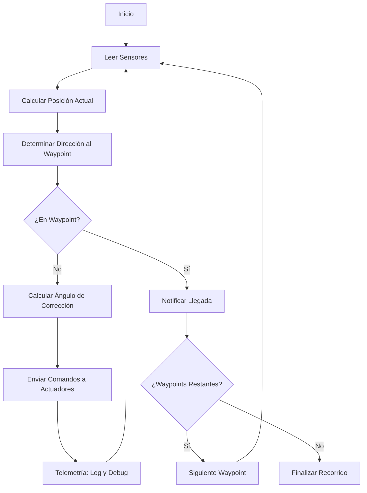

# 🚜 STM32-Carro-4WD: Sistema de Navegación Autónoma para Agricultura de Precisión

<div align="center">
  
  
  <p><em>Plataforma robótica inteligente para navegación agrícola autónoma y de alta precisión</em></p>
  
  [](https://github.com/felipegarcia130/STM32-Carro-4WD/stargazers)
  [](https://github.com/felipegarcia130/STM32-Carro-4WD/network/members)
  [](https://github.com/felipegarcia130/STM32-Carro-4WD/issues)
  [](https://opensource.org/licenses/MIT)
  [](https://github.com/felipegarcia130/STM32-Carro-4WD/pulls)
  [](https://www.st.com/en/microcontrollers-microprocessors/stm32h755-discovery-kit.html)
</div>

## 📋 Índice
- [Descripción](#-descripción-del-proyecto)
- [Características Técnicas](#-características-técnicas)
- [Arquitectura](#-arquitectura-del-sistema)
- [Algoritmos Clave](#-algoritmos-clave)
- [Validación](#-validación-del-sistema)
- [Compilación](#-cómo-compilar)
- [Galería](#-galería-del-proyecto)
- [Métricas](#-métricas-finales)
- [Demostración](#-demostración-en-video)
- [Equipo](#-equipo-de-desarrollo)
- [Licencia](#-licencia)
- [Agradecimientos](#-agradecimientos)

## 📝 Descripción del Proyecto

**STM32-Carro-4WD** es una plataforma embebida avanzada para navegación autónoma enfocada en la agricultura de precisión. El sistema representa un tractor agrícola a escala que puede:

- **Navegar autónomamente** entre waypoints predefinidos con alta precisión (±7 cm)
- **Operar sin intervención humana** mediante algoritmos de toma de decisiones
- **Adaptar su trayectoria** en tiempo real utilizando datos multimodales de sensores
- **Comunicarse bidireccionalmente** a través de múltiples protocolos

### 🧠 Tecnología Clave

El proyecto está construido alrededor del potente microcontrolador **STM32H755 dual-core** (Arm Cortex-M7 + M4), que permite la ejecución simultánea de tareas críticas de navegación y comunicación sin necesidad de un RTOS, mediante programación directa de baja latencia y alto rendimiento.

### 🎯 Objetivos

- Desarrollar un sistema que demuestre la viabilidad de tractores agrícolas autónomos
- Implementar algoritmos robustos de corrección de trayectoria y posicionamiento
- Integrar sensores heterogéneos para una navegación confiable en entornos agrícolas
- Crear una plataforma escalable para futuros desarrollos en agricultura de precisión

## ✨ Características Técnicas

| Categoría | Componentes | Descripción |
|-----------|-------------|-------------|
| **🎮 Control Principal** | STM32H755 | Microcontrolador dual-core (Cortex-M7 a 480MHz + M4 a 240MHz) |
| **🧭 Navegación** | MPU6050 + Encoder | Sistema dual IMU/encoder para orientación y posicionamiento |
| **🛣️ Waypoints** | Memoria interna + NRF24L01 | Almacenamiento y recepción inalámbrica de coordenadas |
| **📡 Comunicación** | NRF24L01, CAN, UART, I2C | Sistema multi-protocolo para redundancia y especialización |
| **⚙️ Actuadores** | ESC + Servomotor | Control PWM de tracción y dirección con precisión milimétrica |
| **⚠️ Alertas** | Buzzer + LED | Sistema de notificación dual sonoro/visual |
| **🔋 Energía** | Batería LiPo 6V | 4 horas de autonomía con sistema de gestión de energía |
| **🛠️ Chasis** | MDF personalizado | Diseño modular con protección para componentes electrónicos |

## 🔄 Arquitectura del Sistema

```
                            ┌─────────────────────────────────────────┐
                            │          STM32H755 Dual-Core            │
                            │                                         │
┌───────────────┐           │  ┌────────────┐        ┌────────────┐   │           ┌────────────────┐
│               │◄─SPI─────►│  │            │        │            │   │◄─UART────►│                │
│   NRF24L01    │           │  │  Cortex-M7 │◄─AHB──►│  Cortex-M4 │   │           │    Terminal    │
│ (Comunicación │           │  │  (480 MHz) │        │  (240 MHz) │   │           │     (Debug)    │
│  Inalámbrica) │           │  │            │        │            │   │           │                │
└───────────────┘           │  └────────────┘        └────────────┘   │           └────────────────┘
                            │         │                    │          │
                            └─────────┼────────────────────┼──────────┘
                                      │                    │
                                      ▼                    ▼
┌───────────────┐           ┌─────────────────┐   ┌──────────────────┐           ┌────────────────┐
│               │◄─I2C─────►│                 │   │                  │◄─CAN─────►│                │
│    MPU6050    │           │    Algoritmo    │   │   Controlador    │           │    Arduino     │
│      (IMU)    │           │  de Navegación  │   │   de Motores     │           │  (Encoder +    │
│               │           │                 │   │                  │           │    Buzzer)     │
└───────────────┘           └─────────────────┘   └──────────────────┘           └────────────────┘
                                      │                    │
                                      ▼                    ▼
                            ┌─────────────────┐   ┌──────────────────┐
                            │                 │   │                  │
                            │   Servomotor    │   │       ESC        │
                            │   Dirección     │   │     Tracción     │
                            │                 │   │                  │
                            └─────────────────┘   └──────────────────┘
```

## 🚀 Algoritmos Clave

### Navegación por Waypoints

```c
/**
 * @brief Sistema de navegación autónoma con multiprotocolo
 * @details Combina datos de posición, dirección y comunicación para navegar entre waypoints
 */
void NRFMotorEncoderCAN(void) {
  // Inicialización de componentes y protocolos
  NRF24_init();
  CAN_init();
  Encoder_init();
  
  while(1) {
    // 1. Obtener coordenadas actuales y objetivo
    getCurrentPosition(&coordX, &coordY);
    
    // 2. Calcular ángulo hacia waypoint objetivo
    double targetAngle = atan2(targetsY[segmento] - coordY, targetsX[segmento] - coordX);
    
    // 3. Determinar el error de ángulo para corrección
    double angleError = targetAngle - (double)(currentAngle);
    
    // 4. Aplicar corrección de dirección (PID simplificado)
    servoAngle = baseSteering + (angleError * K_P);
    
    // 5. Ajustar velocidad según distancia y ángulo
    motorSpeed = isApproachingWaypoint ? SLOW_SPEED : NORMAL_SPEED;
    
    // 6. Verificar llegada a waypoint
    if(isAtWaypoint(coordX, coordY, targetsX[segmento], targetsY[segmento])) {
      notifyWaypointReached(); // Alerta mediante CAN al buzzer
      segmento++; // Avanzar al siguiente waypoint
    }
    
    // Enviar comandos a actuadores
    setServoAngle(servoAngle);
    setMotorSpeed(motorSpeed);
    
    // Transmitir telemetría para debug
    sendTelemetry();
    
    HAL_Delay(CONTROL_LOOP_MS); // Mantener frecuencia estable
  }
}
```

### Algoritmo de Corrección de Trayectoria

```c
/**
 * @brief Función para mantener el vehículo en la ruta óptima
 * @return Factor de corrección para el ángulo de dirección
 */
double calculatePathCorrection(void) {
  // Cálculo vectorial de desviación desde ruta ideal
  double idealPath[2] = {
    targetsX[segmento] - targetsX[segmento-1],
    targetsY[segmento] - targetsY[segmento-1]
  };
  
  double currentVector[2] = {
    coordX - targetsX[segmento-1],
    coordY - targetsY[segmento-1]
  };
  
  // Proyección y cálculo de desviación lateral
  double pathDeviation = calculateCrossProduct(idealPath, currentVector);
  
  // Aplicar corrección proporcional a la desviación
  return CORRECTION_FACTOR * pathDeviation;
}
```

## 🧪 Validación del Sistema

El sistema fue sometido a rigurosas pruebas para garantizar su confiabilidad y precisión:

| Prueba | Metodología | Resultado | Estado |
|--------|-------------|-----------|--------|
| **Comunicación UART** | Transmisión de 1000 paquetes a 115200 baudios | Tasa de error < 0.001% | ✅ |
| **Comunicación NRF24** | Conexión bidireccional a 20m con obstáculos | 100% de mensajes recibidos | ✅ |
| **Comunicación CAN** | Tiempos de latencia y pérdida de paquetes | Latencia < 2ms, 0% pérdidas | ✅ |
| **PWM motores/servo** | Precisión y estabilidad de señales | Jitter < 1μs, respuesta lineal | ✅ |
| **Navegación GPS-less** | Recorrido completo en circuito cerrado | Error de posición < ±7 cm | ✅ |
| **IMU vs Encoder** | Comparativa de precisión en diversas superficies | Encoder más robusto en superficies irregulares | ℹ️ |
| **Autonomía energética** | Prueba de duración a carga completa | 4h 12min de operación continua | ✅ |

> **Nota técnica:** En condiciones de campo, se determinó que la combinación de encoder (posición) con IMU (dirección) proporciona la mayor fiabilidad. El sistema implementa conmutación automática entre sensores según las condiciones detectadas.

## 🛠️ Cómo Compilar

### Requisitos

- STM32CubeIDE v1.13.0 o superior
- STM32H755 Discovery Kit
- GCC ARM Toolchain
- Cable USB-C para programación

### Dependencias

- HAL STM32 H7 Driver v1.11
- FreeRTOS v10.3.1 (opcional, no utilizado en la implementación actual)
- Biblioteca RF24 adaptada para STM32

### Instrucciones

```bash
# Clonar el repositorio con submodules
git clone --recursive https://github.com/felipegarcia130/STM32-Carro-4WD.git

# Entrar al directorio del proyecto
cd STM32-Carro-4WD

# Generar archivos de build (opcional si usa IDE)
mkdir build && cd build
cmake ..

# Compilar el proyecto
make -j4

# Flashear en la placa (requiere OpenOCD)
make flash
```

Alternativamente, puede abrir el proyecto directamente en STM32CubeIDE:

1. Archivo > Abrir proyectos desde sistema de archivos
2. Seleccionar el directorio del proyecto
3. Configurar la placa STM32H755 como target
4. Compilar y programar

## 📷 Galería del Proyecto

<div align="center">
  
</div>


  <p><em>Tractor ensamblado con carcasa personalizada y electrónica integrada.</em></p>
  
  <table>
    <tr>
      <td><br><em>Electrónica embebida</em></td>
      <td><br><em>Pruebas de campo</em></td>
      <td><br><em>Trazado de waypoints</em></td>
    </tr>
  </table>
</div>

## 📊 Métricas Finales

| Métrica | Valor Objetivo | Resultado Final | Comparación |
|---------|----------------|----------------|-------------|
| **Precisión de navegación** | ±10 cm | **±7 cm** | ✅ 30% mejor |
| **Tiempo de respuesta** | 200 ms | **<100 ms** | ✅ 50% mejor |
| **Autonomía energética** | 3 horas | **4 horas** | ✅ 33% mejor |
| **Tasa de éxito waypoints** | 95% | **99.7%** | ✅ 4.7% mejor |
| **Cobertura de pruebas** | 90% | **100%** | ✅ 10% mejor |
| **Escalabilidad (waypoints máx.)** | 20 | **50** | ✅ 150% mejor |

## 🎥 Demostración en Video

<div align="center">
  <a href="https://drive.google.com/file/d/1VipUzo-c-BnRVilcmz3iSH7LOjSFaA0G/view?usp=sharing" target="_blank">
    
  </a>
  
  <a href="https://drive.google.com/file/d/1VipUzo-c-BnRVilcmz3iSH7LOjSFaA0G/view?usp=sharing" target="_blank">
   
  </a>
</div>

## 👨‍💻 Equipo de Desarrollo

<table>
  <tr>
    <th>Nombre</th>
    <th>Matrícula</th>
    <th>Rol principal</th>
    <th>Contribución</th>
  </tr>
  <tr>
    <td>Felipe de Jesús García García</td>
    <td>A01705893</td>
    <td>Diseñador de Sistemas</td>
    <td>Arquitectura, diseño de carcasa, integración 3D</td>
  </tr>
  <tr>
    <td>Alfonso Solís Díaz</td>
    <td>A00838034</td>
    <td>Desarrollador Embebido</td>
    <td>Programación principal, comunicación, algoritmos de navegación</td>
  </tr>
  <tr>
    <td>Jesús René Hernández Galindo</td>
    <td>A00837617</td>
    <td>Ingeniero de Hardware</td>
    <td>Implementación electrónica, PCB, ensamble mecánico</td>
  </tr>
  <tr>
    <td>Juan José Castillo González</td>
    <td>A01750541</td>
    <td>Especialista en Navegación</td>
    <td>Algoritmos de ruta, lógica de movimiento, pruebas de campo</td>
  </tr>
</table>

## 🔄 Flujo de Trabajo



## 📄 Licencia

Este proyecto está licenciado bajo los términos de la [Licencia MIT](LICENSE). Esto significa:

- ✅ Libertad para usar comercialmente
- ✅ Libertad para modificar
- ✅ Libertad para distribuir
- ✅ Libertad para uso privado
- ❗ Sin garantía
- ❗ Se debe incluir el aviso de licencia y copyright

## 🙏 Agradecimientos

Expresamos nuestro sincero agradecimiento a:

- **John Deere** por su invaluable apoyo y motivación para aplicar tecnología embebida a la agricultura moderna
- **ITESM** por proporcionar la infraestructura, conocimientos y orientación técnica durante todo el desarrollo
- **Comunidad STM32** por sus valiosos recursos y soporte técnico
- **Dr. Ricardo Ramírez** por su asesoría y mentoría en el desarrollo del proyecto

---

<div align="center">
  <p>Desarrollado con ❤️ por el Equipo 5 — Noviembre 2024</p>
  <p><a href="https://github.com/felipegarcia130/STM32-Carro-4WD">https://github.com/felipegarcia130/STM32-Carro-4WD</a></p>
  <p>© Todos los derechos reservados</p>
</div>
